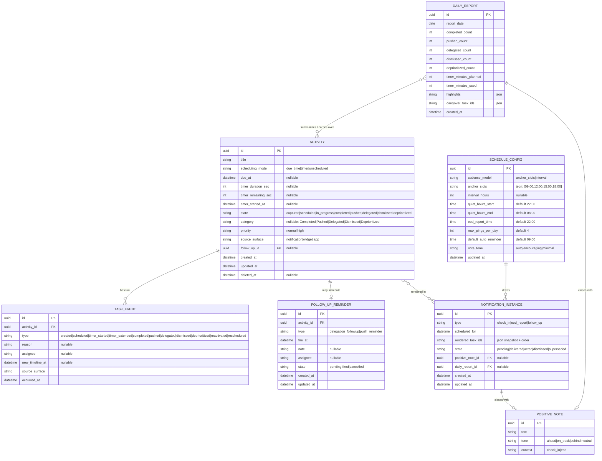
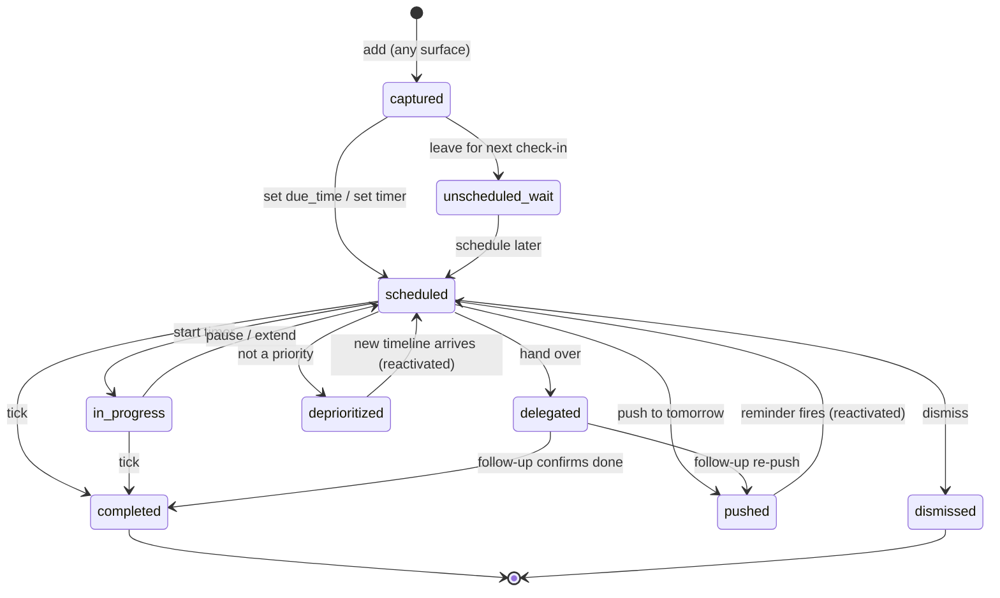

# Nudge — Mobile Data Model

> Companion to `notification-task-app-prd.md`. Local-first schema for MVP (Room on Android / SwiftData on iOS), with a sync-ready shape for V2. The store is the single canonical source; all surfaces are reflections of it.

## Design principles
- **Local-first, single source of truth.** Notifications and widgets render snapshots; they never hold authoritative state.
- **Append-only event stream.** Task state changes are recorded as immutable `TaskEvent`s; the task's current state/category is derived (and cached on the row for fast reads). This is what makes categorized history and full per-task trails work.
- **Idempotent action handling.** Notification/widget actions can replay; writes are keyed so a duplicate "complete" is a no-op.
- **Sync-ready.** Every entity carries `id` (UUID), `created_at`, `updated_at`, and a soft `deleted_at`, so a V2 sync layer can be added without a migration of intent.

---

## Entity overview (ER diagram)

---

## Entity detail & rules

### Activity
- `scheduling_mode` is the discriminator: exactly one of `due_at` / `timer_duration_sec` is meaningful at a time; `unscheduled` means neither. Switching modes is allowed and logged (`rescheduled`/`scheduled` event).
- **Derived/cached:** `state` and `category` are computed from the latest `TaskEvent` and cached on the row for list performance. The event stream is authoritative; the cache is a read optimization rebuilt on write.
- **Soft-terminal vs hard-terminal:** `pushed` and `deprioritized` re-enter `scheduled` when their `new_timeline_at` arrives (a `reactivated` event fires). `completed` and `dismissed` are hard-terminal.
- **Timer math:** `timer_remaining_sec` + `timer_started_at` lets the UI compute live countdown and survive process death; "Extend time" appends to remaining and logs `timer_extended`.

### TaskEvent (append-only)
- Never updated or deleted (except soft-delete cascade). One row per action.
- Drives History categorization (filter by `type`) and the per-task trail (order by `occurred_at`).
- `reason`, `assignee`, `new_timeline_at` are action-specific payload columns (nullable).

### FollowUpReminder
- Created by `pushed` (type `push_reminder`) and `delegated` with follow-up (type `delegation_followup`).
- `fire_at` = user-chosen time or `SCHEDULE_CONFIG.default_auto_reminder` for a "just push."
- On fire → produces a `follow_up` NotificationInstance; state → `fired`. Cancelled if the task is completed/dismissed first.

### NotificationInstance
- One row per rendered check-in / report / follow-up.
- `rendered_task_ids` is a **snapshot** (ids + order) so the instance is reproducible and analytics-stable even as tasks change.
- `state = superseded` enables "replace stale notification" instead of stacking duplicates (dedupe of unread check-ins).

### DailyReport
- Generated at `eod_report_time`; counts derived from that day's `TaskEvent`s; `carryover_task_ids` seeds the Tomorrow planner.

### ScheduleConfig
- Singleton (one row). Owns cadence, quiet hours, EOD time, ping cap, default reminder, note tone. Edits trigger a reschedule.

### PositiveNote
- Small content table selected by `tone` (derived from completion rate) and `context`. Keeps notes purposeful, not random.

---

## State machine (Activity)

`completed` and `dismissed` are hard-terminal. `pushed`/`deprioritized` are soft-terminal (they return). `delegated` resolves via its follow-up.

---

## Indexing & query notes (implementation-aware)
- Index `Activity(state, due_at)` for the Today grouped list (Overdue/Soon/Timed/Anytime).
- Index `TaskEvent(activity_id, occurred_at)` for trails and `TaskEvent(type, occurred_at)` for category History.
- Index `FollowUpReminder(state, fire_at)` for the scheduler's "what fires next" sweep.
- Index `NotificationInstance(state, scheduled_for)` for dedupe/supersede lookups.
- Keep a small **materialized "today summary"** (done/pushed/delegated counts) cache for the Home summary strip and widget, invalidated on relevant events.

## Sync-readiness (V2)
- All entities already carry `id`/`created_at`/`updated_at`/`deleted_at`. Add a `sync_state` (`local|synced|conflict`) and a server `revision` when sync lands; the append-only event stream makes last-writer-wins or event-merge strategies straightforward without restructuring.
