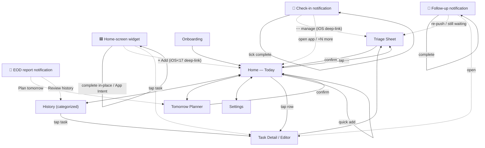
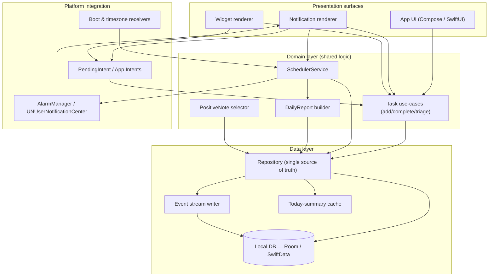
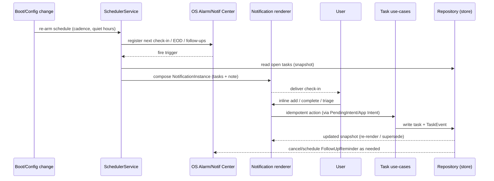

# Nudge — Clickable App Architecture

> Companion to `notification-task-app-prd.md`. "Clickable" = the navigable map of every surface and screen, how they connect, what each tap does, and which deep links bridge out-of-app surfaces into the app. Includes the technical layer architecture beneath the navigation.

---

## 1. Navigation map (clickable flow)

Every node is a destination; every edge is a tap/intent. Dotted edges are **deep links from out-of-app surfaces** (notification/widget) into the app.

**Reading the map**
- Solid edges inside the app are ordinary navigation.
- **Dotted edges are the platform fallback bridges:** on Android these actions happen *in place* on the surface; on iOS (and iOS<17 widgets) they **deep-link** to the labeled screen. The intent ("manage this task," "add a task," "plan tomorrow") is identical; only whether it resolves inline or in-app differs.

### Deep-link / intent table
| Source surface | Action | Android | iOS fallback | Lands at |
|---|---|---|---|---|
| Check-in | Add task | inline reply | text-input action | (stays on notification) |
| Check-in | Complete | inline tick | Complete action | (stays) |
| Check-in | Triage (⋯) | inline sheet | deep link | Triage Sheet |
| Check-in | +N more / open | open app | open app | Today |
| EOD report | Plan tomorrow | tap CTA | tap CTA | Tomorrow Planner |
| Follow-up | Complete | inline | action | (stays) |
| Follow-up | Re-push / waiting | inline | deep link | Triage Sheet |
| Widget | Complete | in-place | App Intent (17+) / deep link (<17) | (stays) / Today |
| Widget | Add | in-place | App Intent (17+) / deep link (<17) | (stays) / Today |

---

## 2. Technical layer architecture

**Layer responsibilities**
- **Surfaces** render only; they call domain use-cases. Notification and widget are *thin renderers* over the same use-cases the app UI uses — guaranteeing functional parity.
- **Domain** holds all business rules: the SchedulerService (cadence, quiet hours, dedupe/supersede, reschedule-on-boot), task use-cases (idempotent add/complete/triage), the DailyReport builder, the PositiveNote selector. This layer is platform-agnostic and is the natural KMP/shared-module boundary if a cross-platform shell is used.
- **Data** is the single source of truth: a Repository over the local DB, an append-only event-stream writer, and a small today-summary cache for fast Home/widget reads.
- **Platform integration** is the only OS-specific code: exact alarms vs UNUserNotificationCenter, PendingIntent vs App Intents, boot/timezone receivers that re-arm the scheduler. **This is where the Android/iOS divergence is isolated** — everything above it is shared.

---

## 3. Notification & scheduling control flow

Key behaviors encoded here: snapshot-based rendering, idempotent action handling (replays are safe), supersede instead of stack, and defensive re-arming on boot/timezone/config change.

---

## 4. Surface ↔ capability matrix (architecture-level)

| Capability | App UI | Android notif | iOS notif | Android widget | iOS widget |
|---|---|---|---|---|---|
| Capture (add) | ✅ | ✅ inline | ✅ text-input | ✅ in-place | ✅17+ / 🔗<17 |
| Complete | ✅ | ✅ inline | ✅ action | ✅ in-place | ✅17+ / 🔗<17 |
| Triage (4 actions) | ✅ | ✅ inline sheet | 🔗 deep-link | 🔗 | 🔗 |
| Set time / timer | ✅ | ✅ chips | 🔗 | 🔗 | 🔗 |
| View list | ✅ full | ✅ top N | ✅ top N (display) | ✅ 3–5 | ✅ 3–5 |
| EOD report | ✅ | ✅ rich | ⚠️ standard | — | — |
| Plan tomorrow | ✅ | 🔗 | 🔗 | — | — |

Legend: ✅ native inline · 🔗 deep-link fallback (intent preserved) · ⚠️ reduced rendering · — not offered on that surface.

This matrix is the contract between product and engineering: **no surface exposes an action it cannot fulfill** — where inline isn't possible, it deep-links rather than silently failing.
